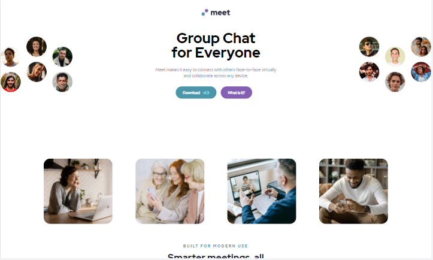
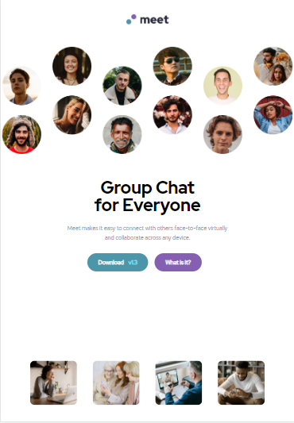

# Frontend Mentor - Meet landing page solution

This is a solution to the [Meet landing page challenge on Frontend Mentor](https://www.frontendmentor.io/challenges/meet-landing-page-rbTDS6OUR). Frontend Mentor challenges help you improve your coding skills by building realistic projects. 

## Table of contents

- [Overview](#overview)
  - [The challenge](#the-challenge)
  - [Screenshot](#screenshot)
  - [Links](#links)
- [My process](#my-process)
  - [Built with](#built-with)
  - [What I learned](#what-i-learned)
  - [Continued development](#continued-development)
- [Author](#author)


## Overview

### The challenge

Users should be able to:

- View the optimal layout depending on their device's screen size
- See hover states for interactive elements

### Screenshot





### Links

- Solution URL: (https://meet-landing-page-rose.vercel.app/)

## My process

I started with writing the HTML codes for each part of the webpage, I have 5 parts (Header, Section, Section, Article, and Footer). I write the HTML codes for each part and also write the CSS code for that part before moving onto the next part. I did all these on desktop-first responsive design. After building the desktop screen, I built the Tablet screen (max-width: 1030px), after that, I built the mobile screen (max-width: 750px).

### Built with

- Semantic HTML5 markup
- CSS custom properties
- Flexbox
- CSS Grid
- Desktop-first responsive design


### What I learned

In this challenge, I learnt how to use a color overlay on a background image, this is the first time I'm using it in a project. 
And I also practise my media query skills in this challenge beacause it's something I'm not yet perfect in it.

```html
<footer>
  .....

 </footer>
```
```css
footer {
  background: linear-gradient(0deg, rgba(70, 150, 168, 0.8), rgba(70, 150, 168, 0.8)), url(./Images/image-footer.jpg);
}
```

### Continued development

I want to focus on media query and responive design. Also currntly learning JavaScript (tho' I didn'nt use it in this challenge), I'd like to 
focus on learning JavaScript and I'd like to continue with ReactJs after before moving to Backend.


## Author

- Twitter - [@abdsalam_saleem](https://www.twitter.com/abdsalam_saleem)


